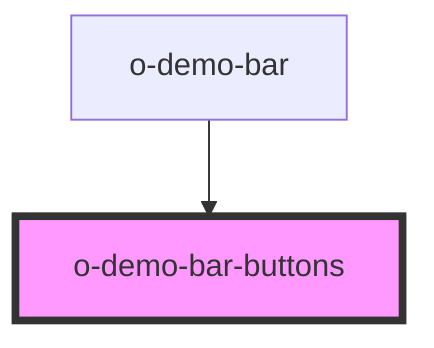

# o-demo-bar-buttons

<!-- Auto Generated Below -->

## Events

| Event                  | Description | Type               |
| ---------------------- | ----------- | ------------------ |
| `toolbarButtonClicked` |             | `CustomEvent<any>` |

## Dependencies

### Used by

 - [o-demo-bar](../o-demo-bar)

### Graph

----------------------------------------------

*Built with [StencilJS](https://stenciljs.com/)*
