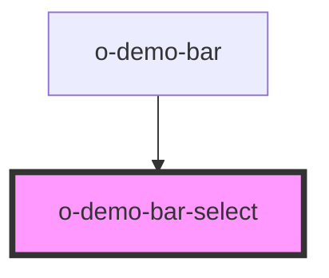

# o-demo-bar-select

<!-- Auto Generated Below -->

## Properties

| Property  | Attribute | Description | Type  | Default     |
| --------- | --------- | ----------- | ----- | ----------- |
| `options` | `options` |             | `any` | `undefined` |

## Events

| Event                 | Description | Type               |
| --------------------- | ----------- | ------------------ |
| `selectedCaseChanged` |             | `CustomEvent<any>` |

## Dependencies

### Used by

 - [o-demo-bar](../o-demo-bar)

### Graph

----------------------------------------------

*Built with [StencilJS](https://stenciljs.com/)*
