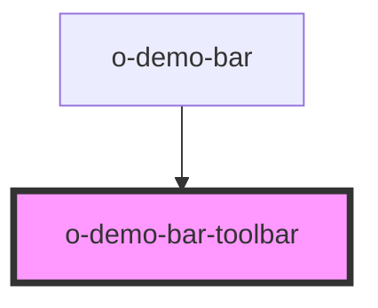

# o-demo-bar-toolbar

<!-- Auto Generated Below -->

## Properties

| Property  | Attribute | Description | Type     | Default     |
| --------- | --------- | ----------- | -------- | ----------- |
| `name`    | `name`    |             | `string` | `undefined` |
| `options` | `options` |             | `any`    | `undefined` |

## Dependencies

### Used by

 - [o-demo-bar](../o-demo-bar)

### Graph

----------------------------------------------

*Built with [StencilJS](https://stenciljs.com/)*
