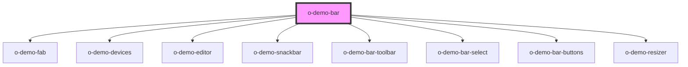

# o-demo-bar

Component for bar
<!-- Auto Generated Below -->

## Properties

| Property             | Attribute              | Description | Type      | Default     |
| -------------------- | ---------------------- | ----------- | --------- | ----------- |
| `backgroundColor`    | `background-color`     |             | `string`  | `undefined` |
| `caseOptionSelected` | `case-option-selected` |             | `number`  | `0`         |
| `device`             | `device`               |             | `string`  | `'desktop'` |
| `deviceSize`         | `device-size`          |             | `string`  | `'1024'`    |
| `events`             | `events`               |             | `string`  | `''`        |
| `name`               | `name`                 |             | `string`  | `undefined` |
| `pattern`            | `pattern`              |             | `boolean` | `true`      |

## Dependencies

### Depends on

- [o-demo-fab](../o-demo-fab)
- [o-demo-devices](../o-demo-devices)
- [o-demo-editor](../o-demo-editor)
- [o-demo-snackbar](../o-demo-snackbar)
- [o-demo-bar-toolbar](../o-demo-bar-toolbar)
- [o-demo-bar-select](../o-demo-bar-select)
- [o-demo-bar-buttons](../o-demo-bar-buttons)
- [o-demo-resizer](../o-demo-resizer)

### Graph

----------------------------------------------

*Built with [StencilJS](https://stenciljs.com/)*
