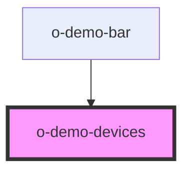

# o-demo-bar-buttons

<!-- Auto Generated Below -->

## Properties

| Property      | Attribute     | Description | Type     | Default     |
| ------------- | ------------- | ----------- | -------- | ----------- |
| `orientation` | `orientation` |             | `string` | `undefined` |

## Dependencies

### Used by

 - [o-demo-bar](../o-demo-bar)

### Graph

----------------------------------------------

*Built with [StencilJS](https://stenciljs.com/)*
