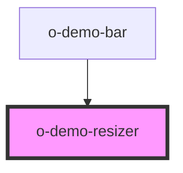

# o-demo-bar-buttons

<!-- Auto Generated Below -->

## Properties

| Property   | Attribute  | Description | Type     | Default     |
| ---------- | ---------- | ----------- | -------- | ----------- |
| `size`     | `size`     |             | `string` | `undefined` |
| `viewport` | `viewport` |             | `string` | `undefined` |

## Events

| Event                 | Description | Type               |
| --------------------- | ----------- | ------------------ |
| `resizeButtonClicked` |             | `CustomEvent<any>` |

## Methods

### `setActiveViewPort(size?: string) => Promise<void>`

#### Returns

Type: `Promise<void>`

## Dependencies

### Used by

 - [o-demo-bar](../o-demo-bar)

### Graph

----------------------------------------------

*Built with [StencilJS](https://stenciljs.com/)*
